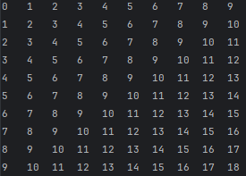
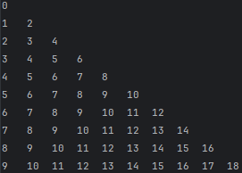
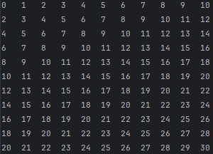
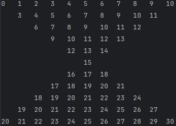

## Conceptos de lógica

Ejercicios:
### 31. Triangular inferior de una matriz
### 34. Reloj de arena

31. **Triangular inferior de una matriz**  
El programa consiste en mostrar la triangular inferior de una matriz de orden N, cuyo valor es ingresado por el usuario. Inicialmente mostrará la matriz completa y posteriormente se mostrará su triangular inferior.

Ejemplo de texto de salida para una matriz de orden 10:

Matriz completa de orden 10:  

Triangular inferior de la matriz:  

34. **Reloj de arena**  
El programa consiste en mostrar una matriz cuadrada de orden N (impar), cuyo valor es ingresado por el usuario. Inicialmente mostrará la matriz completa y posteriormente se mostrará la figura de reloj de arena con los valores que corresponden a su ubicación al formar la figura.  

Ejemplo de texto de salida para una matriz de orden 11:

Matriz completa de orden 11:  

Reloj de arena:  
